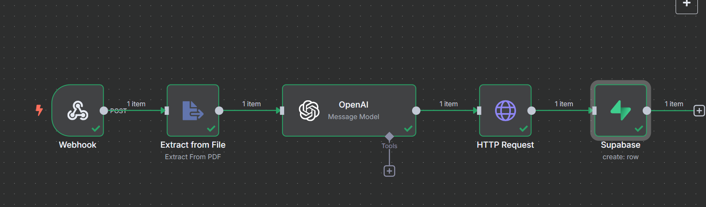

# 📚 PDF Summarization Workflow



---

## 📌 Overview

This project is an **n8n** automation pipeline that allows you to **upload a PDF**, **extract its content**, **summarize it using OpenAI**, **store the file in Supabase Storage**, and **save the generated summary with a link** in a Supabase table.

---

## ⚙️ How It Works

1. **Webhook Trigger**
   - Receives a PDF file via an HTTP POST request.

2. **Extract from File**
   - Extracts text content from the uploaded PDF.

3. **OpenAI Summarization**
   - Uses OpenAI (`GPT-4O`) to generate a clear, concise summary of the PDF content in 300 words or less.
   - Example system prompt:
     ```
     You are an expert educational content summarizer.
     Please read the extracted text and provide a clear, concise summary.
     ```

4. **HTTP Request**
   - Uploads the original PDF file to **Supabase Storage**.

5. **Supabase Row Creation**
   - Stores the summary text and the storage link in a Supabase database table (`pdf_summaries`).

---

## 🗂️ Data Flow

| Step | Action |
|------|--------|
| 📥 Webhook | Accepts file upload |
| 📄 Extract | Reads PDF content |
| 🤖 OpenAI | Generates summary |
| 🌐 HTTP Request | Uploads PDF to Supabase Storage |
| 🗃️ Supabase | Creates a row with `summary` and `pdf_location` |

---

## 🧩 Technologies Used

- [n8n](https://n8n.io) — Automation platform.
- [OpenAI GPT](https://openai.com) — AI summarization.
- [Supabase](https://supabase.com) — Database and file storage.

---

## 🗃️ Supabase Table

**Table:** `pdf_summaries`  
**Fields:**
- `summary` — The generated summary.
- `pdf_location` — Link to the uploaded PDF in Supabase Storage.

---
